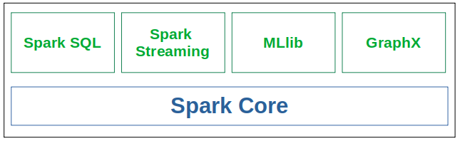
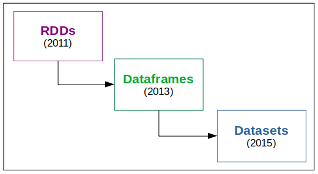

# Fundamental Concepts 

<a href="https://github.com/KattsonBastos/ml-with-spark#contents">Back to Contents</a>

## Distributed Data Processing - What, Why, and How?

&ensp;&ensp;&ensp;&ensp;Distributed Data Processing means we're going to process our data (massive data) in several nodes of a cluster, that is, in a lot of machines/containers.

*(## TODO)*

## What Spark is?

&ensp;&ensp;&ensp;&ensp;Spark is an open-source platform for distributed data processing. Since it executes data in-memory, it is much more efficient in terms of speed than other platforms, such as Hadoop.

&ensp;&ensp;&ensp;&ensp;Since Spark has access to the entire cluster, it can access data from HDFS and Hive tables.

&ensp;&ensp;&ensp;&ensp;As shown later, the recent Spark versions can work both with batch and streaming data.

## What can Spark do? - Spark Components

&ensp;&ensp;&ensp;&ensp;Spark has an underlying execution engine that supports all the other functionalities. That engine is the core of Spark. It works mainly with RDDs and it's used for ETL and batch processing.

&ensp;&ensp;&ensp;&ensp;However, sometimes we don't to work in so a low level. That's where the other modules (Spark Extensions) come in:

- **Spark SQL**: a tool for structured or semi-structured database's queries;
- **Spark Streaming**: real-time streaming data processing;
- **MLlib**: a wide libraryfor Machine Learning that contains many of the main ML algorithms for clustering, classification, regression, and model's evaluation;
- **GraphX**: a library for graph databases manipulation. 

## Spark's Data Representation

Spark works with the three following data representations:

- **Resilient Distributed Datasets (RDD)**: the fundamental data structure in Spark. It's a distributed collection of objects in the cluster 
- **Dataframes**: it's very similar to relational databases tables. That is, data organized in columns. It works with a variaty of data formats, such as *JSON*, *CSV*, and *HDFS*; 
- **Datasets**: it's an extension of the Dataframe with a bit more features -> Object Oriented Programming (OOP) and type-faced interface, which means the compile will validate the data types of each column. 